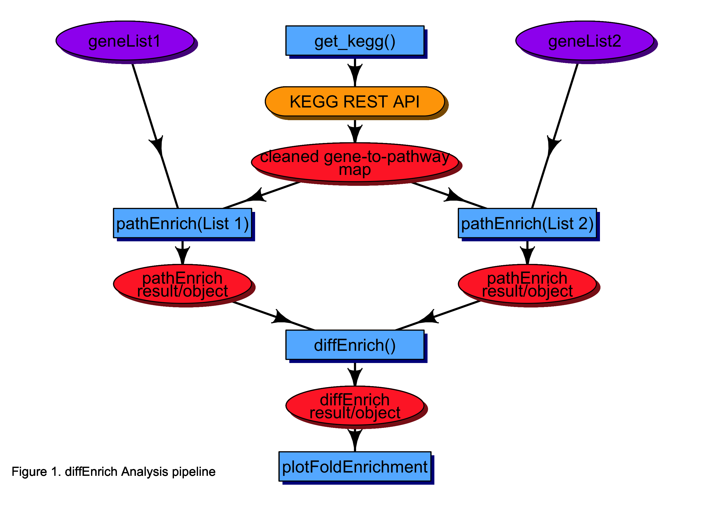
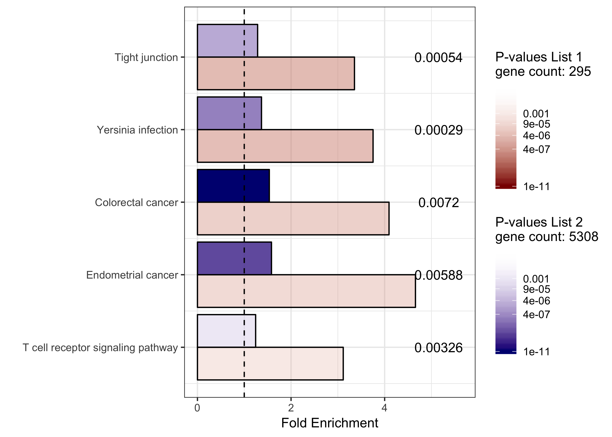

<!-- README.md is generated from README.Rmd. Please edit that file -->

[](https://ci.appveyor.com/project/hsmith9002/diffenrich)

[](https://travis-ci.com/SabaLab/diffEnrich)

# diffEnrich

## Introduction

The goal of diffEnrich is simple. Given a list of gene symbols,
*diffEnrich* will perform differential enrichment analysis using the
Kyoto Encyclopedia of Genes and Genomes (KEGG) REST API. This package
provides a number of functions that are intended to be used in a
pipeline (See Figure 1). Briefly, the workflow will download and clean
species specific ENTREZ gene IDs and map them to their respective KEGG
pathways by accessing KEGG’s REST API. This way the user will always
have the most up-to-date pathway data from KEGG. Next, the user will
identify significantly enriched pathways from two different gene sets,
and finally, the user will identify pathways that are differentially
enriched between the two gene sets. In addition to the analysis
pipeline, this package also provides a plotting function.

**The KEGG REST API**

KEGG is a database resource for understanding high-level functions and
utilities of the biological system, such as the cell, the organism and
the ecosystem, from genomic and molecular-level information
[REF](https://www.kegg.jp/kegg/kegg1a.html). KEGG is an integrated
database resource consisting of eighteen databases that are clustered
into 4 main categories: 1) systems information (e.g. hierarchies and
maps), 2) genomic information (e.g. genes and proteins), 3) chemical
information (e.g. biochemical reactions), and 4) health information
(e.g. human disease and drugs)
[REF](https://www.kegg.jp/kegg/kegg1a.html).

In 2012 KEGG released its first application programming interface (API),
and has been adding features and functionality ever since. There are
benefits to using an API. First, API’s like KEGG’s allow users to
perform customized analyses with the most up-to-date versions of the
data contained in the data base. In addition, accessing the KEGG API is
very easy using statistical programming tools like R or Python and
integrating data pulls into user’s code makes the program reproducible.
To further enforce reproducibilty *diffEnrich* adds a date and KEGG
realease tag to all data files it generates from accessing the API. For
update histories and release notes please go
[here](https://www.kegg.jp/kegg/rest/).



**Differential Enrichment in practice**

A recent
[study](https://onlinelibrary.wiley.com/doi/full/10.1111/acer.13766)
explored the hepatic mechanism for removal of toxic lipid aldehydes via
conjugation with glutathione (Cheng et al.,
[2001](https://www.ncbi.nlm.nih.gov/pubmed/11488593?dopt=Abstract);
Gallagher et al.,
[2007](https://www.ncbi.nlm.nih.gov/pubmed/17553661?dopt=Abstract)) and
the primary enzyme that catalyzes this conjugation, glutathione
S‐transferase A4‐4 (GSTA4). Specifically, the researchers examin the
role of the GSTA4 gene on protein carbonylation and the progression of
liver injury in a model consisting of long‐term (116 days) chronic
ethanol (EtOH) consumption followed by a single EtOH binge.

Functional enrichment of carbonylated proteins for KEGG pathways was
tested using a 1‐sided Fisher’s exact test in each experimental group (2
genotypes × 3 treatment conditions = 6 experimental groups).
Differential enrichment between experimental groups was examined using a
2‐sided Fisher’s exact test. For KEGG pathway enrichment, proteins were
mapped to pathways using their UniProt ID, and databases were downloaded
from the KEGG API.

Note: This example uses proteins as the feature of interest, however
*diffEnrich* currently only supports genes as the feature of interest.

Differential enrichment analysis of carbonylated proteins indicated that
compared to chow‐fed animals, the most overrepresented group of proteins
that was significantly adducted after long‐term EtOH exposure was
ribosomal proteins.

## Installation

You can install the released version of diffEnrich from
[CRAN](https://CRAN.R-project.org) with:

``` r
install.packages("diffEnrich") 
```

## Example

### Step 1: Collect and clean pathways from KEGG API

First we will use the *get\_kegg* function to access the KEGG REST API
and download the data sets required to perform our downstream analysis.
This function takes two arguments. The first, ‘species’ is required and
is the species of interest. Currently, *diffEnrich* supports three
species, and the argument is a character string using the KEGG code
[REF](https://www.pnas.org/content/suppl/2008/09/11/0806162105.DCSupplemental/ST1_PDF.pdf):
Homo sapiens (human), use ‘hsa’; Mus musculus (mouse), use ‘mmu’, and
Rattus norvegicus (rat), use ‘rno’. The second, ‘path’ is also passed as
a character string, and is the path of the directory in which the user
would like to write the data sets downloaded from the KEGG REST API. If
the user does not provide a path, the data sets will be automatically
written to the current working directory using the *here::here()*
functionality. These data sets will be tab delimited files with a name
describing the data, and for reproducibility, the date they were
generated and the version of KEGG when the API was accessed. In addition
to these flat files, *get\_kegg* will also create a named list with the
three relevant KEGG data sets. The names of this list will describe the
the data set. For a ddetailed descritpion of list elements use
*?get\_kegg*.

``` r
suppressMessages(library(diffEnrich))

## run get_kegg() using rat
kegg_rno <- get_kegg('rno')
#> 3 data sets will be written as tab delimited text files
#> File location: /Users/smiharry/Documents/packages/diffEnrich
#> Kegg Release: Release_91.0+_08-28_Aug_19
```

Here are examples of the output files:

    kegg_to_pathway2019-04-26Release_90.0+_04-26_Apr_19.txt
    ncbi_to_kegg2019-04-26Release_90.0+_04-26_Apr_19.txt
    pathway_to_species2019-04-26Release_90.0+_04-26_Apr_19.txt

**Note:** Because it is assumed that the user might want to use the data
sets generated by *get\_kegg*, it is careful not to overwrite data sets
with exact names. *get\_kegg* checks the path provided for data sets
generated ‘same-day/same-version’, and if it finds even one of the
three, it will not re-write any of the data sets. It will still however,
let the user know it is not writing out new data sets and still generate
the named list object. Users can of course generate
‘same-day/same-version’ data sets in different directories if they so
choose.

``` r
## run get_kegg() using rat
kegg_rno <- get_kegg('rno')
#> These files already exist in your working directory. New files will not be generated.
#> Kegg Release: Release_91.0+_08-28_Aug_19
```

### Step 2: Perform individual enrichment analysis

In this step we will use the *pathEnrich* function to identify KEGG
pathways that are enriched (i.e. over-represented) based on two gene
lists of interest. The ENTREZ gene IDs. User gene lists must also be
charater vectors and be formatted as ENTREZ gene IDs. The
*clusterProfiler* offers a nice function (*bitr*) that maps gene symbols
and Ensembl IDs to ENTREZ gene IDs, and an example can be seen in their
[vignette](https://yulab-smu.github.io/clusterProfiler-book/chapter5.html#supported-organisms).

``` r
## View sample gene lists from package data
head(geneLists$list1)
#> [1] "361692"    "293654"    "293655"    "500974"    "100361529" "171434"
head(geneLists$list2)
#> [1] "315547" "315548" "315549" "315550" "50938"  "58856"
```

This function may not always use the complete list of genes provided by
the user. Specifically, it will only use the genes from the list
provided that are also in the most current species list pulled from the
KEGG REST API using *get\_kegg*, or from the older KEGG data loaded by
the user from a previous *get\_kegg* call. The *pathEnrich* function
should be run at least twice, once for the genes of interest in list 1
and once for the genes of interest in list2. Each *pathEnrich* call
generates a data frame summarizing the results of an enrichment analysis
in which a Fisher’s Exact test is used to identify which KEGG pathways
are enriched by the user’s list of interesting genes with respect to
background (universe), and a p-value is calculated using a
hypergeometric distribution (Formula 1). P-values are adjusted for
multiple comparisons by controlling the False Discovery Rate (FDR) at
0.05.

Formula 1:

  
  

where N is the total number of genes in the background, M is the number
of genes within that background that also in the gene set of interest, n
is the size of the list of genes of interest and k is the number of
genes within that are in the background. The background (universe) by
default is all the genes that have annotation.

``` r
# run pathEnrich using kegg_rno
## List 1
list1_pe <- pathEnrich(gk_obj = kegg, gene_list = geneLists$list1)
## list2
list2_pe <- pathEnrich(gk_obj = kegg, gene_list = geneLists$list2) 
```

| KEGG\_PATHWAY\_ID | KEGG\_PATHWAY\_description                             | KEGG\_PATHWAY\_cnt | KEGG\_PATHWAY\_in\_list | KEGG\_DATABASE\_cnt | KEG\_DATABASE\_in\_list | expected | enrich\_p |       fdr | fold\_enrichment |
| :---------------- | :----------------------------------------------------- | -----------------: | ----------------------: | ------------------: | ----------------------: | -------: | --------: | --------: | ---------------: |
| rno04530          | Tight junction - Rattus norvegicus (rat)               |                170 |                      19 |                8856 |                     295 | 5.662827 | 0.0000035 | 0.0008093 |         3.355214 |
| rno05135          | Yersinia infection - Rattus norvegicus (rat)           |                128 |                      16 |                8856 |                     295 | 4.263776 | 0.0000049 | 0.0008093 |         3.752542 |
| rno05210          | Colorectal cancer - Rattus norvegicus (rat)            |                 88 |                      12 |                8856 |                     295 | 2.931346 | 0.0000318 | 0.0034870 |         4.093683 |
| rno05231          | Choline metabolism in cancer - Rattus norvegicus (rat) |                 99 |                      12 |                8856 |                     295 | 3.297764 | 0.0001032 | 0.0067154 |         3.638829 |
| rno05213          | Endometrial cancer - Rattus norvegicus (rat)           |                 58 |                       9 |                8856 |                     295 | 1.932023 | 0.0001132 | 0.0067154 |         4.658328 |
| rno04144          | Endocytosis - Rattus norvegicus (rat)                  |                275 |                      22 |                8856 |                     295 | 9.160456 | 0.0001225 | 0.0067154 |         2.401627 |

Table 1. Head of list1\_pe data frame generated using pathEnrich

*pathEnrich* generates a data frame with 9 columns described below.
Details also provided in *pathEnrich* documentation. Use *?pathEnrich*.

<table class="table table-striped table-hover table-condensed" style="width: auto !important; margin-left: auto; margin-right: auto;">

<caption>

Table 2. Description of columns is dataframe generated by pathEnrich

</caption>

<thead>

<tr>

<th style="text-align:left;">

Column Names

</th>

<th style="text-align:left;">

Column Description

</th>

</tr>

</thead>

<tbody>

<tr>

<td style="text-align:left;">

KEGG\_PATHWAY\_ID

</td>

<td style="text-align:left;">

KEGG Pathway Identifier

</td>

</tr>

<tr>

<td style="text-align:left;">

KEGG\_PATHWAY\_description

</td>

<td style="text-align:left;">

Description of KEGG Pathway (provided by KEGG)

</td>

</tr>

<tr>

<td style="text-align:left;">

KEGG\_PATHWAY\_cnt

</td>

<td style="text-align:left;">

Number of Genes in KEGG Pathway

</td>

</tr>

<tr>

<td style="text-align:left;">

KEGG\_PATHWAY\_in\_list

</td>

<td style="text-align:left;">

Number of Genes from gene list in KEGG Pathway

</td>

</tr>

<tr>

<td style="text-align:left;">

KEGG\_DATABASE\_cnt

</td>

<td style="text-align:left;">

Number of Genes in KEGG Database

</td>

</tr>

<tr>

<td style="text-align:left;">

KEG\_DATABASE\_in\_list

</td>

<td style="text-align:left;">

Number of Genes from gene list in KEGG Database

</td>

</tr>

<tr>

<td style="text-align:left;">

expected

</td>

<td style="text-align:left;">

Expected number of genes from list to be in KEGG pathway by chance
(i.e., not enriched)

</td>

</tr>

<tr>

<td style="text-align:left;">

enrich\_p

</td>

<td style="text-align:left;">

P-value for enrichment of list genes related to KEGG pathway

</td>

</tr>

<tr>

<td style="text-align:left;">

fdr

</td>

<td style="text-align:left;">

False Discovery Rate (Benjamini and Hochberg) to account for multiple
testing across KEGG pathways

</td>

</tr>

<tr>

<td style="text-align:left;">

fold\_enrichment

</td>

<td style="text-align:left;">

KEGG\_PATHWAY\_in\_list/expected

</td>

</tr>

</tbody>

</table>

### Step 3: Identify differentially enriched KEGG pathways

The *diffEnrich* function will merge the results from the *pathEnrich*
calls generated above. Specifically, the data frame ‘list1\_pe’ and the
data frame ‘list2\_pe’ will be merged using the base *merge*
functionality and be merged by the following columns:
‘c(“KEGG\_PATHWAY\_ID”, “KEGG\_PATHWAY\_description”,
“KEGG\_PATHWAY\_cnt”, “KEGG\_DATABASE\_cnt”)’. This merged data set
will then be used to perform differential enrichment using the same
method and p-value calculation as described above. Users do have the
option of choosing a method for multiple testing adjustment.

``` r
## Perform differential enrichment
diff_enrich <- diffEnrich(list1_pe = list1_pe, list2_pe = list2_pe, method = 'none') 
```

<table class="table table-striped table-hover table-condensed" style="width: auto !important; margin-left: auto; margin-right: auto;">

<caption>

Table 3. Description of columns is data frame generated by diffEnrich

</caption>

<thead>

<tr>

<th style="text-align:left;">

KEGG\_PATHWAY\_ID

</th>

<th style="text-align:left;">

KEGG\_PATHWAY\_description

</th>

<th style="text-align:right;">

KEGG\_PATHWAY\_cnt

</th>

<th style="text-align:right;">

KEGG\_DATABASE\_cnt

</th>

<th style="text-align:right;">

KEGG\_PATHWAY\_in\_list1

</th>

<th style="text-align:right;">

KEGG\_DATABASE\_in\_list1

</th>

<th style="text-align:right;">

expected\_list1

</th>

<th style="text-align:right;">

enrich\_p\_list1

</th>

<th style="text-align:right;">

fdr\_list1

</th>

<th style="text-align:right;">

fold\_enrichment\_list1

</th>

<th style="text-align:right;">

KEGG\_PATHWAY\_in\_list2

</th>

<th style="text-align:right;">

KEGG\_DATABASE\_in\_list2

</th>

<th style="text-align:right;">

expected\_list2

</th>

<th style="text-align:right;">

enrich\_p\_list2

</th>

<th style="text-align:right;">

fdr\_list2

</th>

<th style="text-align:right;">

fold\_enrichment\_list2

</th>

<th style="text-align:right;">

odd\_ratio

</th>

<th style="text-align:right;">

diff\_enrich\_p

</th>

<th style="text-align:right;">

diff\_enrich\_adjusted

</th>

</tr>

</thead>

<tbody>

<tr>

<td style="text-align:left;">

rno04530

</td>

<td style="text-align:left;">

Tight junction - Rattus norvegicus (rat)

</td>

<td style="text-align:right;">

170

</td>

<td style="text-align:right;">

8856

</td>

<td style="text-align:right;">

19

</td>

<td style="text-align:right;">

295

</td>

<td style="text-align:right;">

5.662827

</td>

<td style="text-align:right;">

0.0000035

</td>

<td style="text-align:right;">

0.0008093

</td>

<td style="text-align:right;">

3.355214

</td>

<td style="text-align:right;">

131

</td>

<td style="text-align:right;">

5308

</td>

<td style="text-align:right;">

101.89250

</td>

<td style="text-align:right;">

0.0000015

</td>

<td style="text-align:right;">

0.0000056

</td>

<td style="text-align:right;">

1.285669

</td>

<td style="text-align:right;">

0.3832930

</td>

<td style="text-align:right;">

0.0006624

</td>

<td style="text-align:right;">

0.0006624

</td>

</tr>

<tr>

<td style="text-align:left;">

rno05135

</td>

<td style="text-align:left;">

Yersinia infection - Rattus norvegicus (rat)

</td>

<td style="text-align:right;">

128

</td>

<td style="text-align:right;">

8856

</td>

<td style="text-align:right;">

16

</td>

<td style="text-align:right;">

295

</td>

<td style="text-align:right;">

4.263776

</td>

<td style="text-align:right;">

0.0000049

</td>

<td style="text-align:right;">

0.0008093

</td>

<td style="text-align:right;">

3.752542

</td>

<td style="text-align:right;">

105

</td>

<td style="text-align:right;">

5308

</td>

<td style="text-align:right;">

76.71906

</td>

<td style="text-align:right;">

0.0000001

</td>

<td style="text-align:right;">

0.0000003

</td>

<td style="text-align:right;">

1.368630

</td>

<td style="text-align:right;">

0.3648137

</td>

<td style="text-align:right;">

0.0007692

</td>

<td style="text-align:right;">

0.0007692

</td>

</tr>

<tr>

<td style="text-align:left;">

rno05210

</td>

<td style="text-align:left;">

Colorectal cancer - Rattus norvegicus (rat)

</td>

<td style="text-align:right;">

88

</td>

<td style="text-align:right;">

8856

</td>

<td style="text-align:right;">

12

</td>

<td style="text-align:right;">

295

</td>

<td style="text-align:right;">

2.931346

</td>

<td style="text-align:right;">

0.0000318

</td>

<td style="text-align:right;">

0.0034870

</td>

<td style="text-align:right;">

4.093683

</td>

<td style="text-align:right;">

81

</td>

<td style="text-align:right;">

5308

</td>

<td style="text-align:right;">

52.74435

</td>

<td style="text-align:right;">

0.0000000

</td>

<td style="text-align:right;">

0.0000000

</td>

<td style="text-align:right;">

1.535709

</td>

<td style="text-align:right;">

0.3752664

</td>

<td style="text-align:right;">

0.0039469

</td>

<td style="text-align:right;">

0.0039469

</td>

</tr>

<tr>

<td style="text-align:left;">

rno05213

</td>

<td style="text-align:left;">

Endometrial cancer - Rattus norvegicus (rat)

</td>

<td style="text-align:right;">

58

</td>

<td style="text-align:right;">

8856

</td>

<td style="text-align:right;">

9

</td>

<td style="text-align:right;">

295

</td>

<td style="text-align:right;">

1.932023

</td>

<td style="text-align:right;">

0.0001132

</td>

<td style="text-align:right;">

0.0067154

</td>

<td style="text-align:right;">

4.658328

</td>

<td style="text-align:right;">

55

</td>

<td style="text-align:right;">

5308

</td>

<td style="text-align:right;">

34.76332

</td>

<td style="text-align:right;">

0.0000000

</td>

<td style="text-align:right;">

0.0000000

</td>

<td style="text-align:right;">

1.582127

</td>

<td style="text-align:right;">

0.3397394

</td>

<td style="text-align:right;">

0.0066335

</td>

<td style="text-align:right;">

0.0066335

</td>

</tr>

<tr>

<td style="text-align:left;">

rno04660

</td>

<td style="text-align:left;">

T cell receptor signaling pathway - Rattus norvegicus (rat)

</td>

<td style="text-align:right;">

106

</td>

<td style="text-align:right;">

8856

</td>

<td style="text-align:right;">

11

</td>

<td style="text-align:right;">

295

</td>

<td style="text-align:right;">

3.530940

</td>

<td style="text-align:right;">

0.0007743

</td>

<td style="text-align:right;">

0.0193977

</td>

<td style="text-align:right;">

3.115318

</td>

<td style="text-align:right;">

79

</td>

<td style="text-align:right;">

5308

</td>

<td style="text-align:right;">

63.53297

</td>

<td style="text-align:right;">

0.0011075

</td>

<td style="text-align:right;">

0.0022631

</td>

<td style="text-align:right;">

1.243449

</td>

<td style="text-align:right;">

0.3992394

</td>

<td style="text-align:right;">

0.0083807

</td>

<td style="text-align:right;">

0.0083807

</td>

</tr>

<tr>

<td style="text-align:left;">

rno04657

</td>

<td style="text-align:left;">

IL-17 signaling pathway - Rattus norvegicus (rat)

</td>

<td style="text-align:right;">

95

</td>

<td style="text-align:right;">

8856

</td>

<td style="text-align:right;">

9

</td>

<td style="text-align:right;">

295

</td>

<td style="text-align:right;">

3.164521

</td>

<td style="text-align:right;">

0.0042709

</td>

<td style="text-align:right;">

0.0520419

</td>

<td style="text-align:right;">

2.844032

</td>

<td style="text-align:right;">

59

</td>

<td style="text-align:right;">

5308

</td>

<td style="text-align:right;">

56.93993

</td>

<td style="text-align:right;">

0.3737223

</td>

<td style="text-align:right;">

0.4605042

</td>

<td style="text-align:right;">

1.036180

</td>

<td style="text-align:right;">

0.3644360

</td>

<td style="text-align:right;">

0.0098022

</td>

<td style="text-align:right;">

0.0098022

</td>

</tr>

</tbody>

</table>

The result of the *diffEnrich* call is the merged data frame with the
estimated odds ratio generated by the Fisher’s Exact test and the
associated p-value. Users can choose from those supported by
*stats::p.adjust*, and the default is the False Discovery Rate
(Benjamini and Hochberg, [1995](http://www.jstor.org/stable/2346101)).

### Step 4: Plot fold enrichment

This function generates a grouped bar plot using ggplot2 and the
ggnewscale package. KEGG pathways are plotted on the y-axis and fold
enrichment is plotted on the x-axis. each KEGG pathway has a bar
plotting its fold enrichment in list 1 (red) and its fold enrichment in
list 2 (blue). The transparency of the bars correspond to the adjusted
p-value for the pathway’s enrichment in the given list. The p-value
presented as text to the right of each pair of bars is the adjusted
p-value associated with the differential enrichment of the pathway
between the two lists, and the pathways are ordered from top to bottom
by this p-value (i.e. smallest p-value on top of plot, and largest
p-value on bottom of plot).

``` r
## Plot fold enrichment
plotFoldEnrichment(de_res = diff_enrich, pval = 0.05, N = 5)
#> Scale for 'fill' is already present. Adding another scale for 'fill',
#> which will replace the existing scale.
```



## References
